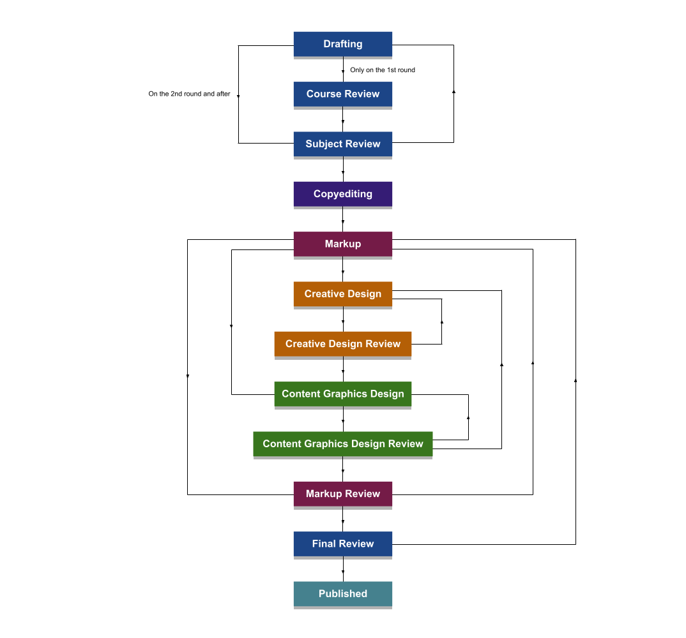

# Describing Workflows

This document describes how the workflows that we use in the development of Nagwa content can be generically described using a simple XML structure.

- [Principles of Design](#principles-of-design)
  - [Workflow XML](#workflow-xml)
  - [History XML](#history-xml)
- [Specification](#specification)

## Principles of Design

The diagram below shows a workflow that we might use for developing an explainer.



There are different ways of describing a workflow like this. Here we will describe it in terms of **statuses**, **transitions**, and **rules**.

The coloured boxes are **statuses**. When a content entity (such as an explainer, question, lesson scope, lesson video, et cetera) has a particular status, it usually means that someone in a particular team must do a particular task for the content entity. For example, if the status is 'Copyediting', then someone from the copyediting team must copyedit the content item, or if the status is 'Final Review', then someone from the relevant subject team must review the content item.

The black arrows are **transitions**. The transitions define what the status of a given content entity may be updated to when it is at a given point in the workflow - or, more simply, how content items can move between statuses. Transitions can have **rules**. For example, in the diagram above, each of the two transitions away from the 'Drafting' status have rules to them - the transition to 'Course Review' is only permitted if the content entity *hasn't* been at 'Course Review' before, and the transition directly to 'Subject Review' (skipping 'Course Review') is only permitted if the content entity *has* been at 'Course Review' once before already.

These three concepts - statuses, transitions, and rules - are sufficient to describe the workflows we tend to use at Nagwa.

### Workflow XML

These three concepts allow us to define a workflow using a simple XML structure. Below is shown this structure without any data in it.

```xml
<workflow>
    <name></name>
    <description></description>
    <statuses>
        <status reference="...">
            <name></name>
            <description></description>
        </status>
        <status reference="...">
            <name></name>
            <description></description>
        </status>
        <status reference="...">
            <name></name>
            <description></description>
        </status>
    </statuses>
    <transitions>
        <transition from="..." to="...">
            <name></name>
            <button_text></button_text>
            <description></description>
            <rules>
                <rule />
                <rule />
            </rules>
        </transition>
        <transition from="..." to="...">
            <name></name>
            <button_text></button_text>
            <description></description>
            <rules>
                <rule />
                <rule />
            </rules>
        </transition>
    </transitions>
</workflow>
```

The root element of the workflow XML is a `<workflow>` element. The `<statuses>` subelement contains the set of statuses for the workflow, and the `<transitions>` subelement contains the set of transitions. 

Each `<status>` element has a `reference` attribute, and these references are used in the `from` and `to` attributes on each `<transition>` element to denote which statuses the transition links. 

Each `<transition>` element contains a `<rules>` subelement, which contains the set of rules that apply to this transition.

Below is shown part of the workflow XML for the workflow shown in the diagram above. The full XML for the above workflow can be viewed [here](workflow/examples/new_explainer.workflow.xml).

```xml
<?xml version="1.0" encoding="utf-8" ?>
<workflow reference="new_explainer">
    <name>New Explainer Workflow</name>
    <description>This workflow is used for creating new explainers.</description>
    <statuses initial="drafting" final="published">
        <status reference="drafting" category="writing">
            <name>Drafting</name>
            <description>The explainer is being drafted.</description>
        </status>
        <status reference="course_review" category="writing">
            <name>Course Review</name>
            <description>The explainer is being reviewed for course suitability.</description>
        </status>
        <status reference="subject_review" category="writing">
            <name>Subject Review</name>
            <description>The explainer is being reviewed for its subject-specific content.</description>
        </status>
    </statuses>
    <transitions>
        <transition reference="submit_to_course_review" from="drafting" to="course_review" type="submit">
            <name>Submit to Course Review</name>
            <button_text>Submit</button_text>
            <description></description>
            <rules>
                <rule allow_if="role in ['content_writer']" />
                <rule allow_if="'course_review' not in pastStatuses" />
            </rules>
        </transition>
        <transition reference="submit_to_subject_review_1" from="drafting" to="subject_review" type="submit">
            <name>Submit to Subject Review</name>
            <button_text>Submit</button_text>
            <description></description>
            <rules>
                <rule allow_if="role in ['content_writer']" />
                <rule allow_if="'course_review' in pastStatuses" />
            </rules>
        </transition>
        <transition reference="submit_to_subject_review_2" from="course_review" to="subject_review" type="approve">
            <name>Submit to Subject Review</name>
            <button_text>Approve</button_text>
            <description></description>
            <rules>
                <rule allow_if="role in ['course_designer']" />
            </rules>
        </transition>
        <transition reference="send_back_to_drafting_1" from="course_review" to="drafting" type="reject" comment_required="true">
            <name>Send back to Drafting</name>
            <button_text>Reject</button_text>
            <description></description>
            <rules>
                <rule allow_if="role in ['course_designer']" />
            </rules>
        </transition>
        <transition reference="send_to_copyediting" from="subject_review" to="copyediting" type="approve">
            <name>Send to Copyediting</name>
            <button_text>Approve</button_text>
            <description></description>
            <rules>
                <rule allow_if="role in ['subject_reviewer']" />
            </rules>
        </transition>
        <transition reference="send_back_to_drafting_2" from="subject_review" to="drafting" type="reject" comment_required="true">
            <name>Send back to Drafting</name>
            <button_text>Reject</button_text>
            <description></description>
            <rules>
                <rule allow_if="role in ['subject_reviewer']" />
            </rules>
        </transition>
    </transitions>
</workflow>
```

The `<workflow>` element has `<name>` and `<description>` subelements. Each `<status>` and `<transition>` element has `<name>` and `<description>` subelements too. Putting anything as the description for a workflow, status, or transition is optional, but it's a good idea to put them, as this can help clarify to developers and designers what must be done when a content entity has a given status.

The `<statuses>` element has attributes `initial` and `final`, which denote the initial and final statuses of the workflow. This tells the system what status to set a content entity to when it first enters the workflow, and at what point the system can take the content entity out of the workflow.

Each `<transition>` element has a `<button_text>` subelement, which gives the text for the button that triggers the transition. This allows us to present developers and designers with very easy-to-understand interfaces, even if the workflow itself is quite complex. In many cases, developers and designers only have the option to send an entity further through the workflow (to 'submit' it or to 'approve' it) or to send it back (to 'reject' it). The `<button_text>` element can be used to present the available transitions as 'Submit' or 'Approve' and 'Reject'.

Each `<status>` element can have a `category` attribute. This can be used to identify groups of related statuses. For example, the statuses 'Creative Design' and 'Creative Design Review' are both part of the creative design process, so might both have `category="creative_design"`. This can allow for a more intuitive, automatic colour-coding of statuses in the user-interface.

Similarly, each `<transition>` element has a `type` attribute. This can be set to one of three values: `submit`, `approve`, or `reject`. This attribute is useful for automatically setting the colour of the buttons that developers and designers will see. If a developer or designer has the option to 'approve' an entity in some way, then we would probably want that button to appear green, whereas if they have the option to 'reject' an entity, then we would probably want that button to appear red or orange.

Each `<transition>` element can also have a `comment_required` attribute, which can be set to `true` or `false`. This indicates whether a developer must add a comment in order to execute a transition. This is generally the case for transitions that represent rejections. If this attribute is left out, it is assumed to have a value of `false`.

Each `<rule>` element has an `allow_if` attribute. The value of this attribute is a predicate describing a condition under which the transition is allowed. The predicate requires a special syntax - this is done in order to keep the structure of the XML simple and readable. However, since we only expect a relatively small number of different kinds of rules in workflows, it will be possible to interpret these predicates just with regular expressions. Rules combine with logical AND rather than logical OR - in other words, all rules must be followed for a transition to be possible. If a transition has no rules to it, then it is always allowed.

### History XML

Certain rules described in the workflow XML require us to know *which* statuses an entity has had in the past, or *which* transitions it has made in the past. An example of this is the rule `<rule allow_if="'course_review' in pastStatuses">`, which allows a given transition only if the entity has had the 'Course Review' status before. Thus, we need a way of keeping track of the statuses that an entity has had, and the transitions it has made.

We also need to keep track of *who* a given content entity is assigned to.

We can keep track of this information, as well as solve a few other problems with the CDS at the same time, by introducing a history XML file. For each content entity in the system, there would be a corresponding history XML file. This file would keep track of the statuses that each entity has had, who it is assigned to, and any comments that have been made on the entity.

The basic structure of a history XML file would have two main parts: a list of 'actions', which describe all historical actions on the entity, when they were taken, and who they were taken by, and a 'state', which would describe the current state of the entity, in order to provide an easy and quick way of looking up the current state.

This structure is shown below, without any data in it.

```xml
<history for_content_entity="explainer/000000000000">
    <state>
        <workflow_reference>...</workflow_reference>
        <workflow_status>...</workflow_status>
        <assignee>...</assignee>
    </state>
    <actions>
        <action taken_at="..." taken_by="..." type="...">
        </action>
        <action taken_at="..." taken_by="..." type="...">
        </action>
        <action taken_at="..." taken_by="..." type="...">
        </action>
    </actions>
</history>
```

The root element is a `<history>` element, and has an attribute `for_content_entity` to denote which content entity this history applies to. The `<history>` element has two subelements: `<state>` and `<actions>`.

The `<state>` element has subelements that define the current state of the entity. This includes `<workflow_reference>`, which identifies which workflow the content entity is currently in (or `none` if it is not in any workflow, making `none` a reserved word), `<workflow_status>`, which identifies the current status of the content entity, and `<assignee>`, which is the email address of the current assignee, as well as other subelements.

The `<actions>` element contains a list of `<action>` elements. Each `<action>` element has an attribute `taken_at`, which is the timestamp of when the action was taken, an attribute `taken_by`, which is the email address of the person who took the action, and an attribute `type`, which denotes the type of action, and which can have values such as `changed_status`, `changed_assignee`, `added_comment`, et cetera. An `<action>` element can also contain other elements that give additional information about the action taken.

Below is shown part of a hypothetical history XML document for an explainer in the new explainer workflow. You can see the example in full [here](history/examples/000000000000.history.xml).

```xml
<?xml version="1.0" encoding="utf-8" ?>
<history for_content_entity="explainer/000000000000">
    <state>
        <workflow_reference>new_explainer</workflow_reference>
        <workflow_status>course_review</workflow_status>
        <assignee>none</assignee>
        <priority>high</priority>
        <watchers>
        </watchers>
    </state>
    <actions>
        <action taken_at="2021-04-26T10:00:00" taken_by="example.user.1@nagwa.com" type="created_entity">
        </action>
        <action taken_at="2021-04-26T10:00:00" taken_by="system" type="changed_workflow">
            <new_workflow_reference>new_explainer</new_workflow_reference>
        </action>
        <action taken_at="2021-04-26T10:00:00" taken_by="system" type="changed_workflow_status">
            <new_workflow_status>drafting</new_workflow_status>
        </action>
        <action taken_at="2021-04-26T10:00:10" taken_by="example.user.1@nagwa.com" type="changed_assignee">
            <new_assignee>example.user.1@nagwa.com</new_assignee>
        </action>
        <action taken_at="2021-04-26T10:00:20" taken_by="example.user.1@nagwa.com" type="changed_priority">
            <new_priority>high</new_priority>
        </action>
        <action taken_at="2021-04-26T10:30:00" taken_by="example.user.1@nagwa.com" type="added_comment">
            <comment_reference>c1</comment_reference>
            <comment_text>This is my comment.</comment_text>
        </action>
        <action taken_at="2021-04-26T11:00:00" taken_by="example.user.1@nagwa.com" type="changed_workflow_status">
            <new_workflow_status>course_review</new_workflow_status>
        </action>
        <action taken_at="2021-04-26T11:00:00" taken_by="system" type="changed_assignee">
            <new_assignee>none</new_assignee>
        </action>
    </actions>
</history>
```

This XML describes the history of the content entity for a short while after it was created. Looking through the list of actions, we can see what has happened and when. This is also summarised in the table below.

| Time | What happened? |
|---|---|
| 10:00:00 | The explainer was created by a user with the email address example.user.1@nagwa.com. As this entity is an explainer, the system automatically put it into the new explainer workflow, and gave it the initial status, which is `drafting`. |
| 10:00:10 | Ten seconds after the explainer was created, the same user assigned it to themself to work on it. Ten seconds after that, they set the priority to `high`. |
| 10:30:00 | The same user added a comment to the content entity. |
| 11:00:00 | The same user moved the entity to 'Course Review'. The system automatically unassigned it from them, as they are not able to transition it away from 'Course Review' once they've put it there. |

In addition to keeping track of what statuses a content entity has and hasn't had, there are several very useful features that the history XML offers, which are described below.

- **It makes it possible to add comments to an entity at any time.**
  This would be an extremely useful feature in content development. Very often, we know that something needs to happen with a particular question or explainer, or any other item, but this isn't something we need or are able to do straight away. It would be extremely convenient to be able to just attach this information as a comment to an item whenever we need to, so that we make sure that the right information stays with a given item, and that everyone who works on the item can see it.
- **It allows us to look back through the history of an item very easily.**
  As part of content development, we often want to know what's happened to a content item over time - who has worked on it, when they worked on it, and any comments that they left. Storing the history of the item in this way allows us to very easily build a picture of what's happened with an item.
- **It allows us to 'watch' content items.**
  It would be very convenient to have the option for users to 'watch' certain content items. This would mean that when certain actions are added to the history of the item, any users who are watching that item are notified. This would make it much easier to respond to comments and queries quickly.

In addition to this, using this system of a workflow XML and a history XML, choosing *who* should work on a given content item once it has reached a given status should be decided manually, and can be decided or changed at any time. The structure of the history XML file allows for this. This makes it a lot easier to organise who is going to do what, and to reassign a task to someone else should the original assignee become very busy with a separate task or project.

This system also introduces priority flags in the history XML. Very often some content items are considered to be of higher priority than others - at the moment we don't really have a good way of communicating this through the CDS.

Together, the workflow XML and the history XML are a simple way of describing workflows and the work done on different pieces of content, and add a lot of useful features.

## Questions and Answers

### Why not place a role limitation on the statuses rather than the transitions?

At the moment, the limitations on how users in different roles can interact with the content entities is placed on the transitions, as one of the set of rules, rather than on the statuses. Why is this? Would it not be simpler to place role limitations on statuses, to say that only users with certain roles can act on certain statuses? Below is shown what this might look like in the XML.

```xml 
<status reference="drafting" role="content_writer">
```

There are several reasons for placing the role limitations on the transitions, rather than the statuses.

1. Placing a role limitation on a status carries the implication that only users in that role can interact with a content entity of that status. However, we would like to move to a way of working where users can view or add comments to any content item easily, regardless of their role or its status - users would be able to *interact* with a content item in some ways, but they wouldn't be able to transition it. So the role limitation applies to the ability to transition the item, rather than the ability to interact with it at all.
2. We may want to have multiple transitions away from a given status that are accessible to people in different roles. For example, we may want to allow someone in an administrator or project manager role to transition a content item back from final review to drafting. (We have, in the past, had situations where the requirements of a piece of content have changed after it has gone through most of the workflow.) Attaching the role limitation to the transitions allows for this.
3. Placing the roles limitations on the transitions allows us to keep all rules associated with an action together in the `<rules>` tag. This makes it easier to see all the conditions that must be met for a transition to be allowed when looking through the XML, as they are all in one place, rather than in different places. 

### What is the purpose of the `category` attribute?

The purpose of the `category` attribute on the `<status>` elements is to group together similar statuses. This is to make it easy to colour-code statuses in the user interface and in automatically-drawn diagrams of the workflow. For example, statuses such as 'Creative Design' and 'Creative Design Review' are very similar, and we would probably want them to have the same colour in the user interface and in a diagram.

### Why do `<transition>` elements have `reference` attributes?

There are several reasons for this.

1. It allows the transitions that a given content item has made to be referenced in the history XML, and for those transitions to be searched, and for rules to be applied to them. For example, we might want to apply a rule to a transition of the kind `<rule allow_if="'drafting_to_course_review' in pastTransitions">`. Such rules are likely to be rare, but including transition references allows for maximum flexibility of the workflow rules. Such rules could not be defined using status references alone (for example, with something like `<rule allow_if="('drafting' to 'course_review') in pastTransitions">`) as there may be multiple transitions between two statuses with different conditions applied on, say, user role, and using status references alone does not distinguish between them.
2. It simplifies the workflow XML - all statuses and transitions must have a reference attribute - it is never optional.
3. It makes it easier to write code to interact with the workflow XML. When interacting with the workflow XML through code, it's useful to have a unique way of referring to each transition (and status). This makes it easier to manipulate and search through the transitions when they are in dictionaries or lists, and it also makes it easier to query the XML using something like XPath.

It is expected that the references for all statuses and transitions within the workflow XML would be generated automatically, so even though these references are sometimes quite long, they would not have to be typed out manually.

## Specification

To be written later if necessary.

#### The &lt;workflow&gt; element

The `<workflow>` element is the root element of a Workflow XML file. It contains two subelements: a `<statuses>` element and a `<transitions>` element.

##### Attributes

| Name | Required | Allowed Values | Description |
|---|---|---|---|
| `reference` | Required | any | A string that's used by the system to identify this workflow. |

##### Examples

Below is shown an example of the `<workflow>`, `<statuses>`, and `<transitions>` elements.

```xml
<workflow reference="workflow1">
    <statuses>
        ...
    </statuses>
    <transitions>
        ...
    </transitions>
</workflow>
```
